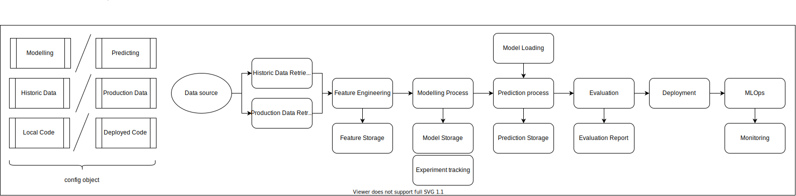
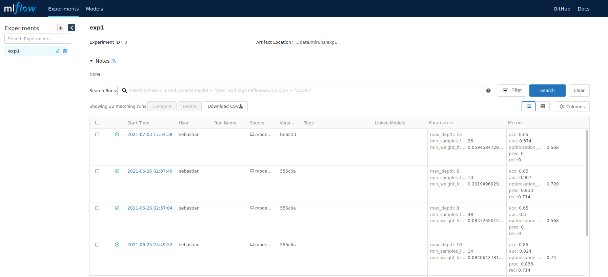
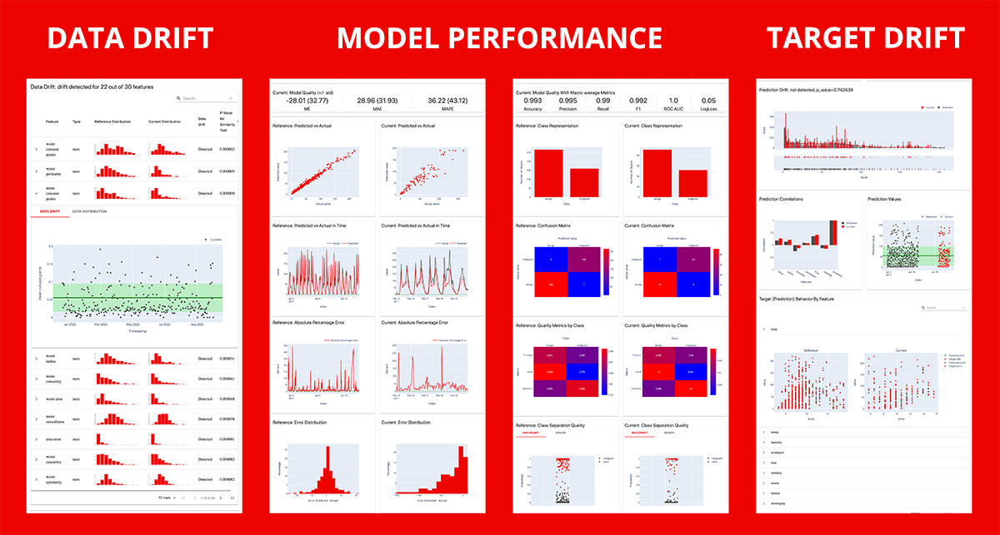

I created a Machine Learning Project template for quick project bootstrapping. Check out the repo on github:
 [https://github.com/wavelike/ml_project_template](https://github.com/wavelike/ml_project_template)

# Overview

This repo contains a full-fledged Machine Learning project codebase for both model development, deployment and ML monitoring tasks.
It is intended to be used as a template to kickstart any ML project with the focus on productionising the model in order to start the BML (Build - Measure - Learn) cycle quickly and enabling the project to evaluate business goals from the start as opposed to building pipelines for weeks until until being exposed to the real world.

I try to continuously add new functionality and design pattern to this template. Whenever it is used to kickstart a project, a clone should be made and project-specific functionality (preprocessing, model algorithms etc.) manually added and existing code snippets potentially be removed, thus this codebase was not made to act as a stable distributional package or framework, but really rather as a thoroughly desinged starting point to prevent development of boilerplate code.

Whenever I start a new ML project, I start it up with this template.

# How to use

Entrypoints for various use cases are present under the `use_cases/` directory:
- *modelling_historic_data_local.py*: Training a model based on historic data on the local machine
- *predicting_historic_data_local.py*: Loads existing model artifacts and historic data and creates predictions on a local machine
- *predicting_production_data_local.py*: Simulates a stream of incoming production data instances that are ingested one after one to the prediction pipeline on a local machine
- *predicting_production_data_local_fastapi.py*: Same as above with the difference of providing access to the model via a local API endpoint
- *predicting_production_data_deployed_server.py*: Same as above with the API endpoint being deployed to a cloud server

Each of these cases utilises a collection of pipeline components (see *code architecture* chapter below)

# Functionality
## Machine Learning Preprocessing, Modelling and Evaluation

Since this codebase is used as a template, you are free to paste functionality from whatever algorithmic framework you want to use, be it scikit-learn, TensorFlow, PyTorch, Xgboost, Catboost, Lightgbm or anything else.

ML functionality:
- full ML pipeline tasks: data ingestion and preprocessing, model training and optimisation, model selection via a leaderboard and model artifact export
- usage of exported ML pipeline artifact for prediction on batch or instance-level data
- experiment tracking and model registry management via MLflow
- feature engineering    
    - This template suggests a consistent interface for feature engineering processes, that allows to unit test each engineering process and reuse the same code for local development and server-based production.
    

## Machine Learning Engineering

Since this template is intended to be used as a production-ready starting point for a project - as opposed to notebook based research projects -, it comes along with
many best practices from the world of ML Engineering and Software Engineering in order to enable the user to create well-tested, productionisable and reliable code.
Among these best practices you will find:
- CI/CD tasks like code linting (isort), automatic testing (pytest), and type checking (mypy)
- package and environment management via Pipenv
- containerisation of prediction services via docker
- infrastructure setup via terraform
- local deployment of the model pipeline via REST APIs (flask or fastapi)
- deployment of code and model artifacts to various services: AWS Lambda, AWS Sagemaker, Google Cloud function, Google App Engine, Heroku
- code testing via pytest
- runtime logging 
- experiment parameter and artifact logging to provide ML metadata to enable artifact lineage tracking (ml metadata)
- data and schema validation using pandera to assure data quality and prevent training-serving skew 
- MLOps: production drift and prediction monitoring using evidently
- centralised definition of parameters via a Config object (as opposed to parameter settings scattered across the code)

  
  
# Code architecture and project structure

# code architecture

The code is divided into several components typical for Machine Learning tasks. Each component is represented via a python module within the `ml_project` package (which should be renamed according to your project's title).
Executable entrypoints are structured under the `use_cases` folder. Each run is defined via a `Config` instance that specifies most of pipeline's parameters, e.g. the data source, the amount of cross validation runs or the categorical and numerical features.
Moreover, each config should specify the run mode and select one parameter of the following mutually exclusive pairs:
- Modelling run vs. prediction run: Whether the run is used to train, build and export model artifacts, or to load exxisting ones in order to perform predictions
- Historic vs. Production data: Is the run intended to be load historic batch data, or will it be executed in a more production environment where data is received instance- or minibatch-wise
- Local vs. deployed code and artifacts: Is the run executed on your local machine, or are model artifacts and codebase deployed on a cloud service?

With these settings you can create use cases for all necessarily steps from ML modelling over local API server testing to full deployment - all sharing the same codebase and config object and fully testable.

In addition to the terms introduced above, I use the following names for denoting particular datasets throughout their states in a ML pipeline:
- production data: the data we receive directly from our data source (database, warehouse, stream) without any preprocessing 
- raw data: Validated production data that adheres to predefined schemas and expectations. Potentially fields / columns not need for the run are dropped. This is the dataset we can safely ingest into our ML pipeline
- engineered data: contains engineered features in addition to the columns given by the raw data
- preprocessed data: The result of pipeline preprocessing steps like scaling, nan-imputing, categorical encoding etc. This is the final data state that will be used by the model.

## Project structure

The following directories and files are part of the project:

    ml_project_template: project root, to be renamed according to your project's title
    -d data: storage directory for (small) datasets and model artifacts
    -d deployment: specific functionalities for various api frameworks and cloud providers
    -d documentation
    -d executables: shell scripts
    -d ml_project: contains all pipeline code, to be renamed according to your project's title
    -d output: where output artifacts like zipped code or plots are stored
    -d tests: tests for the ml_project functionalities
    -d use_cases: All executable entrypoints 
    -f .gitignore
    -f cicd_pipeline.sh: contains CI/CD tasks like linting, automatic testing and type checking
    -f Pipfile: dependency definition
    -f Pipfile.lock
    -f project_config.yaml: contains configs not specific to a use case run, but important for the whole codebase
    -f README.md
    

 
# Projects

While the vanilla codebase is using a simple ML pipeline with a random forest model, the following repositories contain specialised model pipelines, all based on this very template:
- TODO

# Deployment

The following sections explain how to modify the template in order to enable deployment on a specified cloud provider.
Most of the functionality is provided via the `executables/cloud_setup.sh` script in which you should specify the cloud service of your choice.
Execution then essentially copies files from the `deployment` directory to the project's root, if needed builds docker images and then either directly deploys the code for you (e.g. via sagemaker) or lets you easily do it in the cloud provider's CLI as all artifacts are prepared and ready to be deployed.

Note: Some shell commands require *sudo* execution - this might be necessary e.g. to run docker locally if not configured differently. But it is not safe and you should configure your system in such a way that you can safely remove all *sudo* commands.

## heroku

- project preparation: 
    - `bash executables/cloud_setup.sh` with `cloud_provider='heroku'`
- the above command creates the following files in the source dir:
    - Procfile: Used for Heroku deployment
- push your code via git to heroku: `git push heroku <branch>`

## google app engine

- project preparation: 
    - `bash executables/cloud_setup.sh` with `cloud_provider='google_app_engine'`
- the above command creates the following files in the source dir:
    - main.py: entrypoint
    - requirements.txt: for dependencies (does not support pipfile)
    - .gcloudignore: Which files not to upload
    - app.yaml: App definition, e.g. the python version
- deploy code via `gcloud app deploy` (assuming the app is created already)

## google cloud function

- project preparation: 
    - `bash executables/cloud_setup.sh` with `cloud_provider='google_cloud_function'`
    - the above command creates a zip file at `output/function_deployment/function_deployment.zip` to be uploaded to a storage bucket and contains all code and data needed to run the cloud function in the cloud.
- terraform execution
    - infrastructure setup steps:
        - storage_bucket creation
        - loading *function_deployment.zip* to bucket
        - cloud function creation
    - `cd deployment/google_cloud_function`
    - building infrastructure: `terraform init` + `terraform validate` + `terraform apply` -> confirm with 'yes'
    - set Permissions to `'member=AllUsers', 'role=Cloud Functions Invoker'`
    - destroying infrastructure: `terraform destroy`

## local lambda container

- project preparation:
    - `bash executables/cloud_setup.sh` with `cloud_provider='aws_lambda'` creates a docker image with all code and objects needed for the API
- Start a docker container manually based on the image to start the prediction server: `sudo docker run -p 8080:8080 mltemplate_lambda`
- prediction server url: "http://localhost:8080/2015-03-31/functions/function/invocations"

## aws lambda

- project preparation:
    - `bash executables/cloud_setup.sh $AWS_ACCOUNT_ID` with `cloud_provider='aws_lambda'` creates a docker image with all code and objects needed for the API and then pushes it to AWS ECR (Elastic Container Registry). 
    Make sure to pass as first parameter the *$AWS_ACCOUNT_ID* which in this case is expected to be an environment variable.
- go to the AWS CLI and create a new lambda function based on the image 
- Assure that permissions for public invocations are given

## aws sagemaker
- make sure to have aws credentials available on your machine
- no setup in *aws console* is needed
- project preparation: 
    - `bash executables/cloud_setup.sh` with `cloud_provider='sagemaker'`
- the above command creates the following files in the source dir:
    - setup_sagemaker_endpoint.py: Sets up an endpoint (local or hosted)
- run endpoint: 
    - In `./setup_sagemaker_endpoint.py` specify `instance_type'` with value in `('local', 'ml.t2.medium')`. 
        - If you chose the hosted endpoint, then upload the zipped model_objects via <<<TODO<<<
    - Eploy endpoint via: `sudo -E env "PATH=$PATH" pipenv run python setup_sagemaker_endpoint.py`
    - Remember the `endpoint_name`
- testing: 
    - `deployment/tests/test_prediction_service_sagemaker_local.py`  
    - set `endpoint_name=<endpoint_name>` 
    - set`sagemaker_session = sagemaker.LocalSession()` for local endpoint or `sagemaker_session = sagemaker.Session()` for hosted endpoint

# MLOps

## MLflow
Experiment artifacts (parameters, models, plots, metrics, etc.) are stored via *MLflow* (https://mlflow.org/) in a local sqlite database. To open an html report to visualise all experiments use the following command:

`pipenv run mlflow ui --backend-store-uri sqlite:///mlflow.db`

    
## ML monitoring
A drift and model performance report is available via *evidently* (https://evidentlyai.com/)

    
